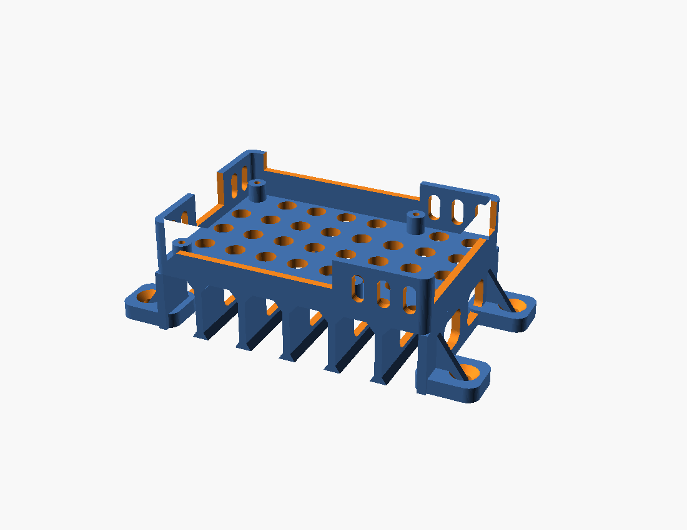
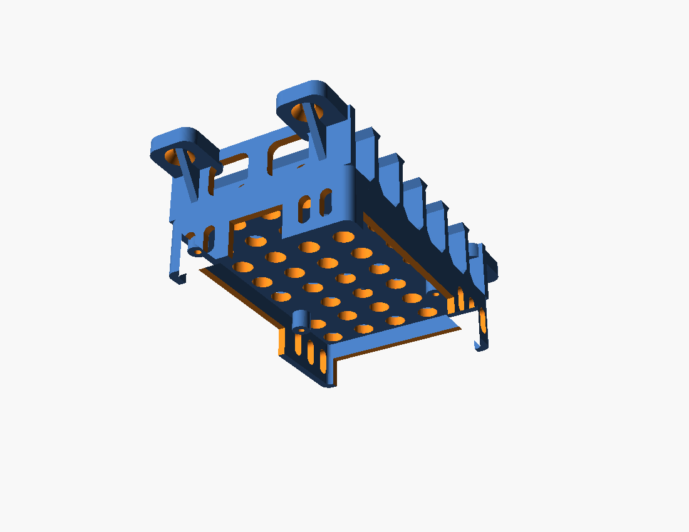

# Raspberry Pi 3 wall-mount vented case

A one-piece, support-free case for a **Raspberry Pi 3 Model B** that screws flat to a
plywood wall and holds the board **20 mm off the wall** so air can move underneath it.



## How it breathes

The case is two stacked structures. The lower one is a set of seven fins that run across
the *short* axis of the board; they carry the whole case on four countersunk ears that sit
flat against the plywood. Mounted with the long edge horizontal, those fins become vertical
chimneys — cool air enters along the bottom edge, rises through the 36 vent holes in the
back plate, passes over the board, and leaves through the open top and the wide-open port
edges. Nothing is enclosed on more than three sides.

| | |
|---|---|
| Air gap, wall to back plate | 20 mm |
| Standoff under the PCB | 6 mm |
| Open vent area in the back plate | ~1200 mm² |
| Board sides fully open | Ethernet/USB edge, power/HDMI/AV edge, top |



## Just print it

`rpi3_wall_mount_Ender3V3SE_PLA_0.2mm.gcode` is sliced and ready. Drop it straight into
OctoPrint's Files panel and hit print — no slicer needed.

| | |
|---|---|
| Printer | Ender-3 V3 SE, 0.4 mm nozzle (stock OrcaSlicer vendor profile) |
| Material | PLA, 220 °C nozzle / 55 °C bed |
| Time | 2 h 58 m |
| Filament | 47.5 g, 15.9 m |
| Layers | 190 @ 0.2 mm |

The first thing it does is draw two prime lines down the left edge of the bed at X≈-2.
That is Creality's stock start G-code, not a mistake.

Re-slice yourself only if you want a different material or nozzle.

## Slicing it yourself

Slice `rpi3_wall_mount.stl` exactly as exported — it already sits flat on the bed in the
correct orientation.

| Setting | Value |
|---|---|
| Supports | **None** — nothing overhangs past 45° |
| Layer height | 0.2 mm |
| Perimeters | 3 (walls are 2.4 mm, so they come out fully solid) |
| Top/bottom layers | 4 |
| Infill | 15–20% (barely used; the part is nearly all wall) |
| Brim | 5 mm recommended — the fins land on the bed as thin lines |
| Material | PLA is fine. PETG if the wall gets direct sun or sits near a heat source. |
| Filament | ~55 g |
| Time | ~4 h |

Bed size needed is 121 × 62 mm, well inside the 220 × 220 bed.

The back plate bridges the gaps between fins. Each fin flares out to 8 mm at the top so the
longest unsupported bridge is about 9 mm, which the SE handles cleanly with the default
bridging settings. The feet flare to 5.5 mm for bed adhesion.

## Hardware

- **4 × M2.5 × 6 mm self-tapping screws** — hold the Pi to the four bosses. The bosses have
  2.2 mm pilot holes, so a self-tapping screw cuts its own thread. M2.5 machine screws work
  too if you tap them first.
- **4 × #8 × 25 mm flat-head wood screws** (or M4) — into the plywood. The ear holes are
  4.5 mm with a 90° countersink, so the heads sit flush.

## Mounting

Drill a rectangle of four pilot holes in the plywood:

```
    <------------ 107.8 mm ------------>

    o                                  o     ^
                                             |  43.8 mm
    o                                  o     v
```

Orientation matters for airflow — mount it so the **fins run vertically**, i.e. the long
edge of the Pi is horizontal. Put the power/HDMI/audio edge at the **bottom** so cables
hang down and out of the airflow. Ethernet and USB then face left or right, your choice of
which way you flip it.

Screw the case to the wall first, then drop the Pi in and fasten the four M2.5 screws.

## Access

Everything stays reachable with the Pi installed:

- Ethernet and both USB stacks — that entire edge is open
- micro-USB power, HDMI, AV jack — that entire edge is open
- microSD — slot in the left wall, card comes out sideways
- GPIO — the case is open on top; there is also a 6 mm notch in the top wall for a ribbon
  cable to exit
- Camera/DSI ribbon connectors — open from above

## Editing the model

`rpi3_wall_mount.scad` is parametric. The values worth touching are at the top:

```openscad
gap     = 20;   // air gap between the plywood and the back plate
tray_h  = 15;   // how far the tray walls come up past the board
boss_h  = 6;    // standoff height under the PCB
n_span  = 6;    // number of air channels across the back
```

Re-render with:

```sh
openscad -o rpi3_wall_mount.stl rpi3_wall_mount.scad
```

## Fit notes

Dimensions follow the Raspberry Pi 3 Model B mechanical spec: 85 × 56 mm board, mounting
holes 58 × 49 mm on 3.5 mm corner insets, 0.5 mm clearance per side. It also fits the
Pi 2 B and Pi 3 B+, which share the same board outline, hole pattern, and port layout.
It does **not** fit the Pi 4 (the port positions moved) or the Pi Zero.

Every connector position was checked against the model for clearance before release.
```
PCB              OK        micro-USB pwr    OK
Ethernet         OK        HDMI             OK
USB stack A      OK        AV jack          OK
USB stack B      OK        microSD card     OK
GPIO header      OK
```

## Files

| File | |
|---|---|
| `rpi3_wall_mount_Ender3V3SE_PLA_0.2mm.gcode` | ready to print, send straight to OctoPrint |
| `rpi3_wall_mount.stl` | ready to slice |
| `rpi3_wall_mount.scad` | parametric source |
| `img/` | renders |
